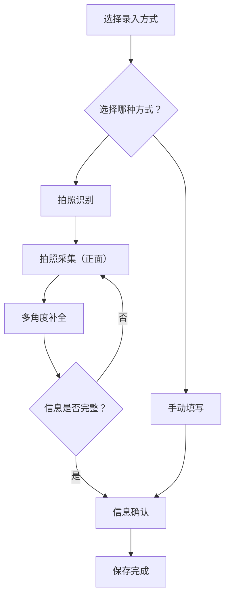

## 1. 产品概述

药品信息录入系统是一款移动端优先的 Web 应用，帮助药店工作人员或医护人员通过拍照识别和手动输入两种方式快速、准确地录入药品信息（名称、有效期至、生产厂家、批号等）。

- 目标用户：药店店员、药品仓库管理员、医院药房工作人员
- 核心价值：替代传统纸质记录，通过 OCR 识别 + 多角度补拍提高录入效率，减少人工输入错误

## 2. 核心功能

### 2.1 用户角色

无需注册登录，单用户本地使用。

### 2.2 功能模块

1. **录入方式选择页**：提供"拍照识别"和"手动填写"两种录入入口
2. **拍照采集页**：模拟相机取景器，拍摄药品正面照片
3. **多角度补全页**：展示已识别和待拍摄字段，支持继续拍摄补全
4. **手动录入页**：表单形式手动填写药品信息
5. **信息确认页**：展示 OCR 识别结果，支持编辑修改
6. **保存完成页**：保存成功反馈，展示药品摘要信息

### 2.3 页面详情

| 页面名称 | 模块名称 | 功能描述 |
|---------|---------|---------|
| 录入方式 | 标题区 | 显示"录入药品信息"标题和引导副标题 |
| 录入方式 | 拍照识别卡片 | 带"推荐"标签，点击进入拍照采集流程 |
| 录入方式 | 手动填写卡片 | 点击进入手动录入表单 |
| 拍照采集 | 步骤指示器 | 显示"步骤 1/3"进度 |
| 拍照采集 | 取景器 | 模拟相机取景框，带四角标识和虚线引导框 |
| 拍照采集 | 提示卡片 | 提示优先识别药品名称 |
| 拍照采集 | 拍摄按钮 | 圆形拍摄按钮，点击模拟拍照 |
| 多角度补全 | 进度标题 | 显示"信息采集进度 (1/3)" |
| 多角度补全 | 字段状态卡片 | 已识别字段显示绿色对勾和"已识别"标签，待拍摄字段显示拍摄按钮 |
| 多角度补全 | 提示卡片 | 提示缺少的信息 |
| 多角度补全 | 底部操作 | "继续拍摄"和"查看结果"按钮 |
| 手动录入 | 表单 | 药品名称、有效期至、生产厂家、批号四个输入字段 |
| 手动录入 | 提示横幅 | 提示可留空，并提供"去拍照补全"链接 |
| 手录入 | 底部操作栏 | "取消"和"保存"按钮 |
| 信息确认 | OCR 来源提示 | 显示"以下信息来自 OCR 识别结果" |
| 信息确认 | 表单字段 | 药品名称、有效期至、生产厂家、批号（带"识别"标签），备注（选填） |
| 信息确认 | 缩略图区 | 显示拍摄的照片缩略图 |
| 信息确认 | 底部操作栏 | "取消"和"保存"按钮 |
| 保存完成 | 成功状态 | 绿色对勾图标 + "保存成功"标题 |
| 保存完成 | 摘要卡片 | 展示药品名称、有效期至、厂家摘要信息 |
| 保存完成 | 底部操作 | "继续录入"和"完成"按钮 |

## 3. 核心流程

用户打开应用后，选择录入方式（拍照或手动填写）。若选择拍照，进入拍照采集页拍摄药品正面，然后进入多角度补全页查看识别进度，可继续拍摄侧面/底部补全信息，确认后进入信息确认页核对 OCR 结果，最后保存完成。若选择手动填写，直接进入表单页填写后确认保存。

## 4. 用户界面设计

### 4.1 设计风格

- **主色调**：暖橙色系（#c96442），用于主按钮、强调色和品牌元素
- **辅色**：暖灰/米色系（#e9e6dc, #faf9f5），用于卡片背景和辅助区域
- **成功色**：灰绿色（#788c5d），用于完成状态提示
- **错误色**：红色（#d64545），用于错误提示
- **按钮风格**：圆角（12px-16px），柔和阴影，悬停微抬升
- **字体**：标题用 Poppins（无衬线），正文用 Poppins + Lora（衬线）混合使用
- **布局风格**：卡片式布局，圆角大（16px-24px），柔和阴影
- **整体调性**：温暖、专业、简洁的移动端设计

### 4.2 页面设计概览

| 页面名称 | 模块名称 | UI 元素 |
|---------|---------|---------|
| 录入方式 | 选择卡片 | 圆角大卡片（16px圆角），带图标、标题、描述文字，"推荐"标签为深色按钮风格 |
| 拍照采集 | 取景器 | 4:3 比例的取景框，虚线引导框 + 四角定位标识，居中 scan 图标 |
| 多角度补全 | 状态卡片 | 带图标和状态标签的卡片列表，已识别用绿色对勾，待拍摄用 outline 圆圈 |
| 手动录入 | 表单 | 标准圆角输入框（12px圆角），带 label 和占位符 |
| 信息确认 | 表单 | 带"识别"标签的只读输入框，虚线边框的备注输入框 |
| 保存完成 | 结果页 | 居中布局，大号绿色对勾，摘要卡片，底部固定按钮 |

### 4.3 响应式设计

- 移动端优先设计，最大内容宽度 375px-430px（iPhone 尺寸）
- 桌面端居中显示，两侧留白，模拟手机卡片效果
- 所有触摸目标至少 44px 高度
- 底部按钮固定栏，适合单手操作

## 5. 多端适配

- 移动端：全屏沉浸式体验，底部固定按钮栏
- 平板端：内容区域居中，最大宽度 480px
- 桌面端：在浏览器中模拟手机视口效果
