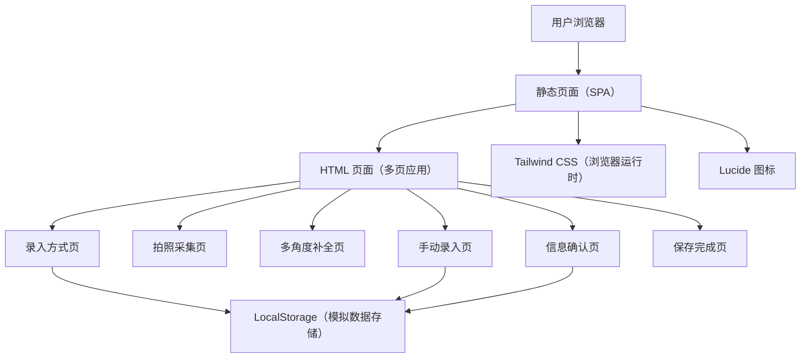

## 1. 架构设计



## 2. 技术说明

- **前端**：纯 HTML + Tailwind CSS (CDN 运行时) + Lucide 图标库
- **构建工具**：无需构建，直接使用 CDN 加载依赖
- **后端**：无后端，纯前端静态页面
- **数据存储**：使用 LocalStorage 模拟数据存储和页面间传参
- **设计系统**：基于 CSS 变量的自定义设计系统（暖橙色系）

## 3. 路由定义

| 路由 | 用途 |
|------|------|
| /index.html | 录入方式选择页（首页） |
| /pages/capture.html | 拍照采集页 |
| /pages/complete.html | 多角度补全页 |
| /pages/manual.html | 手动录入页 |
| /pages/confirm.html | 信息确认页 |
| /pages/saved.html | 保存完成页 |

## 4. 数据模型

### 4.1 药品信息数据模型

```typescript
interface DrugInfo {
  name: string;       // 药品名称
  expiryDate: string; // 有效期
  manufacturer: string; // 生产厂家
  batchNo: string;    // 批号
  remark: string;     // 备注
}

interface CaptureProgress {
  nameCaptured: boolean;
  expiryCaptured: boolean;
  manufacturerCaptured: boolean;
  batchCaptured: boolean;
}
```

### 4.2 页面间数据传递

- 使用 URL 查询参数传递简单状态
- 使用 LocalStorage 存储录入中的药品数据
- 拍照模拟：不涉及真实相机，用 click 事件模拟拍照完成

## 5. 设计系统变量

所有颜色和样式变量统一在 `:root` 中定义，包括：

- 品牌色：`--brand-500: #c96442`（暖橙色）
- 文本色：`--text-800: #3d3929`（暖棕色）
- 背景色：`--bg-100: #faf9f5`（米白暖灰）
- 成功色：`--success-500: #788c5d`（灰绿）
- 错误色：`--error-500: #d64545`（红色）
- 字体：Poppins（标题/UI）/ Lora（正文）/ Newsreader（展示）
- 圆角：8px / 12px / 16px / 20px / 24px
- 阴影：2px 到 2xl 五层阴影系统
